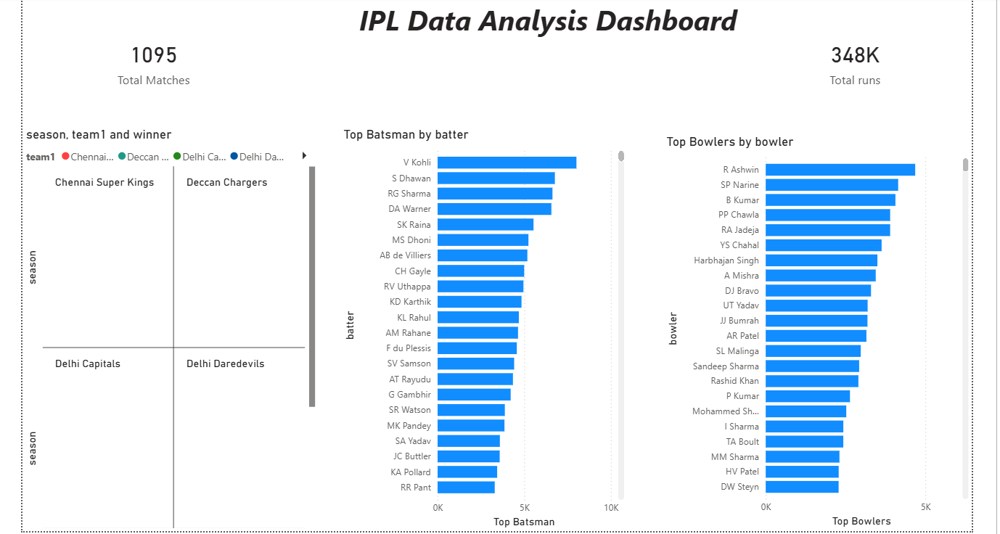

# 🏏 IPL Data Analysis

## 🎯 Problem Statement

The goal of this project is to analyze IPL data to understand team performance, player statistics, and match trends.

---

## 📌 Project Overview

This project analyzes IPL matches and deliveries data to find insights about top teams, best players, and overall match performance.

---

## 🛠️ Tools Used

* Python (Pandas, Matplotlib)
* Power BI
* Data Analysis Techniques

---

## 📊 Dataset

* matches.csv → match details
* deliveries.csv → ball-by-ball data

---

## ⚙️ Steps Performed

* Data Cleaning
* Data Analysis
* Player Performance Analysis
* Team Performance Analysis
* Dashboard Creation

---

## 📈 Key Insights

* **A few teams dominate IPL consistently**
* **Top batsmen contribute majority of runs**
* **Top bowlers take significant wickets**
* **Player performance has major impact on match outcomes**

---

## 📸 Dashboard

---

## 💡 Conclusion

The analysis shows that team success in IPL depends heavily on key players' performance. Consistent top performers play a crucial role in winning matches.

---

## 🚀 Future Work

* Add season-wise analysis
* Predict match winners
* Player performance trends

---

## 🙌 Author

Ashwini Bendawade
